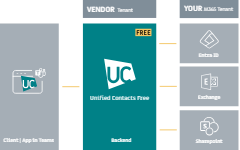

# Backend Permissions


If you add an **Azure AD Group**, only direct members of the group will receive access.


1.  **Search** for the Unified Contacts Backend **App Registration**

    <figure><figcaption>
Azure Portal with the Unified Contacts AppRegistrations
</figcaption></figure>
2.  **Open** the App Registration and click on the link to the linked **Enterprise App**

    <figure><figcaption></figcaption></figure>
3.  Under **Properties** enable the setting "Assignement required?" and click "Save"

    <figure><figcaption></figcaption></figure>
4.  You can now add users and groups that shall receive access to the Unified Contacts Backend via the "Users and groups" section

    <figure><figcaption></figcaption></figure>

    <figure><figcaption></figcaption></figure>

    <figure><figcaption></figcaption></figure>
