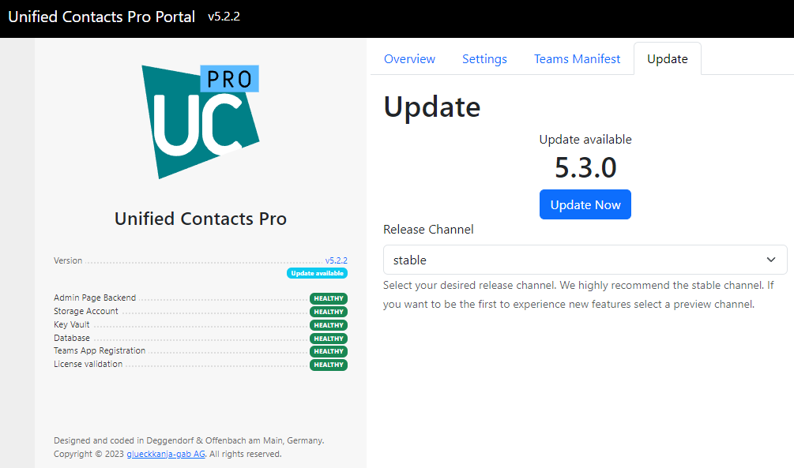
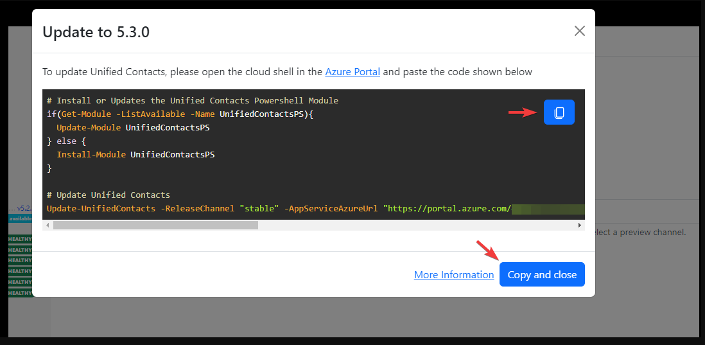
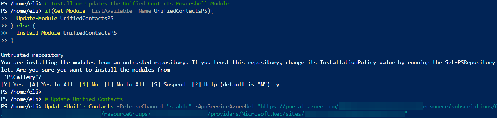
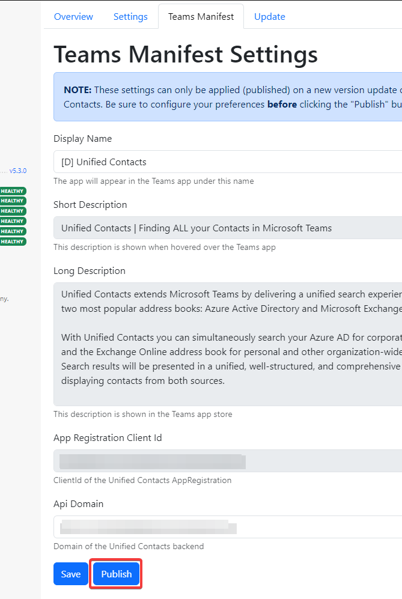

# Update Strategy


Unified Contacts Pro & Community Edition only.



This documentation is for Unified Contacts Pro versions 5.2.0 and higher. To update older versions of Unified Contacts please use [this documentation](updating-from-older-versions-less-than-1.5.1.md)


Updating Unified Contacts is very easy. The backend regularly checks whether a new version of Unified Contacts is available from our different [release channels](release-channels.md). If that is the case, the backend portal will display a notification next to the "Version" information.

## Update Procedure

To update Unified Contacts:

1. Navigate to the Unified Contacts backend website. For that, navigate to the Unified Contacts **App Service**, select "Overview" and click "Browse".
2. Go to the "Update" tab and choose the [release channel](release-channels.md)

<figure><figcaption></figcaption></figure>

3. If an update for your chosen [release channel](release-channels.md) is available click "Update Now"
4. Copy the content of the black box to your clipboard

<figure><figcaption></figcaption></figure>

5. Check if the `AppServiceAzureUrl` is the correct URL from your Unified Contacts **App Service**, should it be the wrong URL please replace it&#x20;
6. Open the **Azure Cloud Shell** (PowerShell) on **Azure Portal** and wait until it has fully loaded.
7. Paste the previously copied commands and press \[ENTER]

<figure><figcaption></figcaption></figure>

7. The PowerShell script will install the latest version of the UnifiedContactsPS Module and subsequently the latest version of the selected [release channel](release-channels.md) of the Unified Contacts app.
8. **After the script is finished, return to the Unified Contacts App Service and go to the "Teams Manifest" tab.**

<figure><figcaption></figcaption></figure>

9. Click "Publish" to upload a new version of the Teams Manifest

<figure><figcaption></figcaption></figure>

