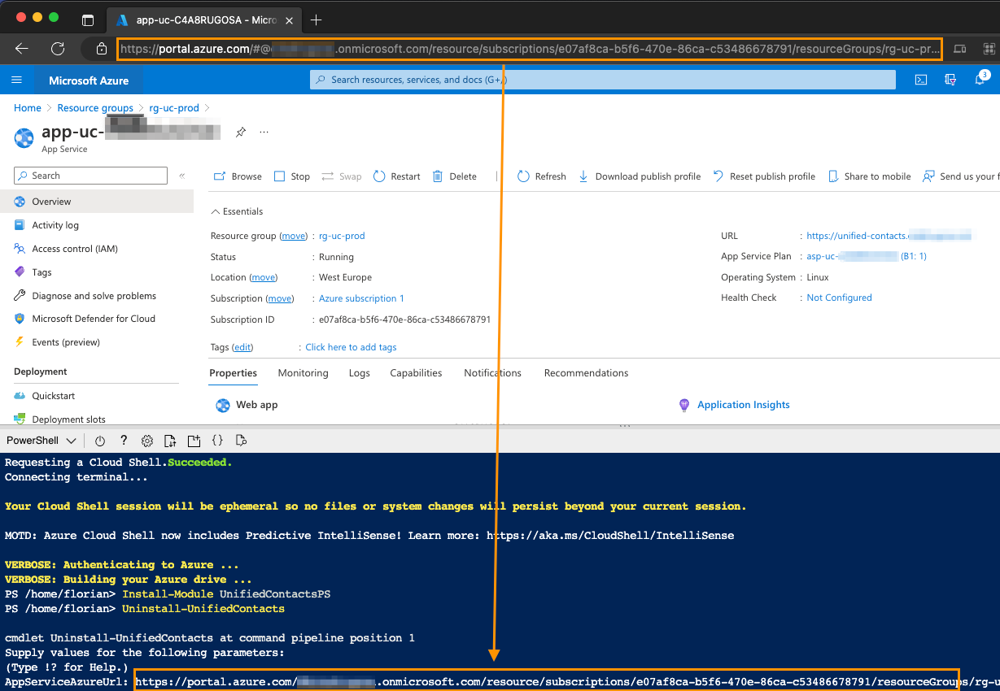

# Unified Contacts Pro

To uninstall Unified Contacts Pro from your tenant, please go through the following steps:

## Step 1: Uninstall Teams App (Front-end)

To remove the Unified Contacts Teams App (front end)

* Open the [**Teams Admin Center**](https://admin.teams.microsoft.com/) and navigate to "Teams apps" --> "Manage apps" and locate the Unified Contacts app.
* Open the app, click on the three dots subsequently to "Actions" --> "Delete"

<figure><figcaption></figcaption></figure>

## Step 2: Uninstall the Unified Contacts Pro Backend

To remove the Unified Contacts backend including all **App registrations**

* Invoke the **Azure Cloud Shell** and paste the following command:&#x20;

```powershell
Install-Module UnifiedContactsPS
Uninstall-UnifiedContacts
```

*   You will be prompted for the "AppServiceAzureUrl". Get this URL by navigating to the Unified Contacts **App Service** "Overview" blade. Then, copy the URL from your browser and paste it into the **Azure Cloud Shell** and press **Enter**.\


    <figure><figcaption></figcaption></figure>
* Confirm that you would like to delete the Unified Contacts **Resource group**.
* Once the script has completed (**this might take up to 5 minutes**), all Unified Contacts resources are removed from your Azure tenant.
