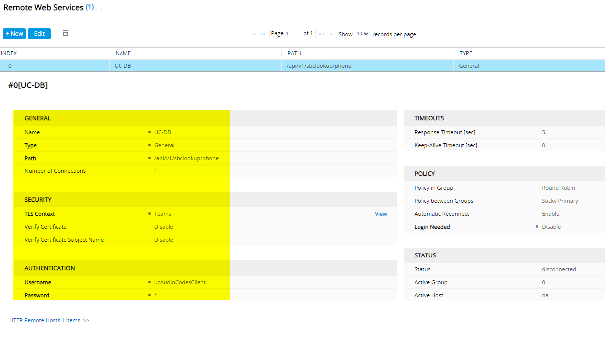
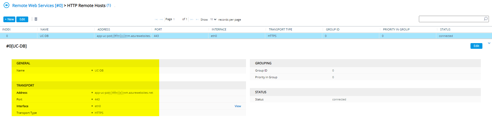
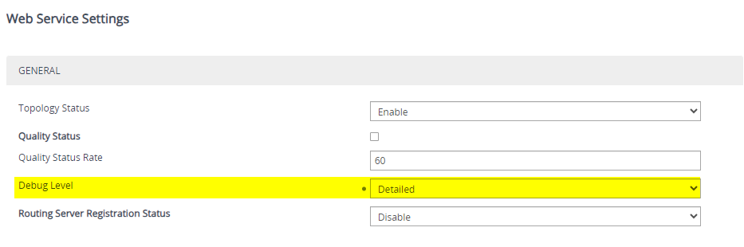
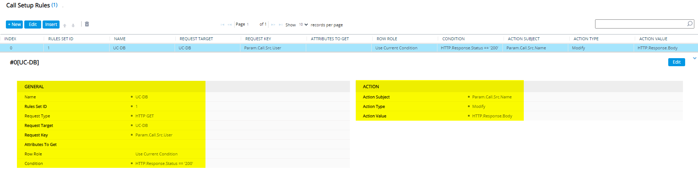

# SBC Number Lookup


Applicable to version 5.4.0 and above\
Unified Contacts Pro only


With Unified Contacts 5.4.0 and later you can perform a reverse number lookup against contacts in the Unified Contacts Database and inject the DisplayName of the caller into the SIP header.

## Setup

### Unified Contacts Settings

Per default the SBC Lookup Endpoint is **disabled**. To enable it open the Unified Contacts Admin Portal and click on **Settings**. All settings will be have to be configured under the category **SBC Lookup**.


If you have updated recently and can't see the  **SBC Lookup** Category you might have to clear your browser cache and reload the page.


#### Enable the SBC Lookup Endpoint

Per default the SBC Lookup Endpoint is **disabled**. To enable it open the Unified Contacts Admin portal at the root page. Navigate to **Settings** **> SBC Lookup** and enable the **SBC Lookup Endpoint**.

<figure><figcaption></figcaption></figure>

#### Configure IP Authentication


We highly recommend having IP Authentication enabled.&#x20;

Without it you expose the lookup endpoint publicly into the internet, secured only by Basic Auth.


To allow access to the Endpoint you can specify an allow-list of IP addresses that are allowed to access the Endpoint. You can add any valid IPv4 or IPv6 address. Add it by entering the address into the input field and click on the **+** Button.

<figure><figcaption></figcaption></figure>

To delete an IP address from the allow-list click on the trash bin symbol.

<figure><figcaption></figcaption></figure>


The endpoint validates the last IP address in a forwarding chain. If you have the Unified Contacts AppService set up behind a reverse proxy, load balancer or other proxy service(s) the request will be treated as if it was send from the outbound IP address of the last proxy in the chain. In such cases make sure to implement your own firewall in front of the proxy service and add the IP address(es) of your proxy service(s) to the SBC Lookup endpoint allow-list.


#### Configure Authentication Credentials

As most SBCs don't support modern Authentication the SBC Lookup endpoint uses Basic Auth for Authenticating requests. To use the Endpoint you have to set a username and password. Those are the credentials you will also have to enter in your SBC.

<figure><figcaption></figcaption></figure>


Usernames have to have at least 3 chars. Only alphanumerical chars are allowed

Passwords have to have at least 16 chars and contains at least one special character. Only alphanumerical chars and a list of special characters (!?@#$%^&\*()\_+-=\[]{}) are allowed



After you leave this page you will not be able to see the credentials you have configured. Make sure to store the credentials securely (e.g. in your Password Manager). If you forget the credentials you have to set new ones.


### SBC Setup

#### AudioCodes SBC Mediant Series

Setup an AudioCodes SBC requires the configuration of Remote Web Services and a Call Setup Rule.

First go to Setup -> IP Network -> Web Services -> Remote Web Services and create a new RWS. Give it s unique name on your SBC as it will be used in the Call Setup Rule later.\
Usage Type is General and Path must be /api/v1/sbclookup/phone.\
You need to specify a TLS Context as the connection will be secured, we recommend to use the same TLS Context you use for your connection to MS Teams.\
Username and password are those you defined earlier in the section above in the Unified Contacts Pro Portal.&#x20;

<figure><figcaption></figcaption></figure>

Next step is to define the HTTP Remote Host on the same screen, just click the blue link below password.

The value for Address you can copy from your Unified Contacts Pro Portal website. Here we need to enter the App Service URL, the Port should be changed to 443 and Transport Type to HTTPS.\
As Interface select the one you want to use and from which you specified the public IP address in Unified Contacts Pro Portal.

<figure><figcaption></figcaption></figure>

To get information of the Web Services you might want to enable logging on the SBC. This can be done in Setup -> IP Network -> Web Services -> Web Services Settings. Just modify the Debug Level to Detailed

<figure><figcaption></figcaption></figure>

Finally, you need a Call Setup Rule which queries the database on an incoming call.\
Just go to Setup -> Signaling & Media -> SIP Definitions -> Call Setup Rules and create a new one. \
Request Type is HTTP GET and Request Target must be the Remote Web Services Name.\
Request Key is the calling number, so enter Param.Call.Src.User. \
Next a condition is required to make sure that messages are manipulated only when a match is found. This should be HTTP.Response.Status == '200'.\
As an action we're going to modify Param.Call.Src.Name with the body of the 200 OK message received. So Action Value is HTTP.Response.Body

<figure><figcaption></figcaption></figure>

This CSR must be added to any IP Group on which you want to run the Reverse Name Lookup. Likely on every PSTN SIP Trunk IP Group.


You might have already some Call Setup Rules on your SBC and one or more are already assigned to IP Groups on which you want to run this feature.\
In this case you create the new Call Setup Rule with the same Rule Set ID. If you have multiple Rule Sets in use, just create multiple rules to meet your environment.

