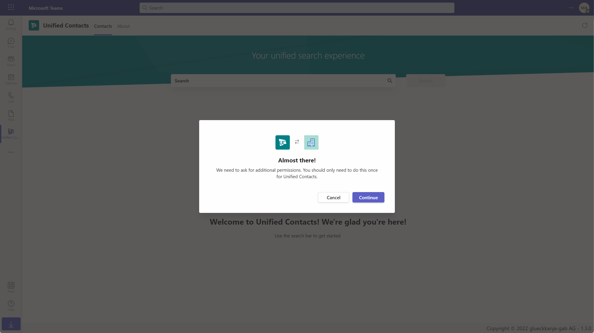
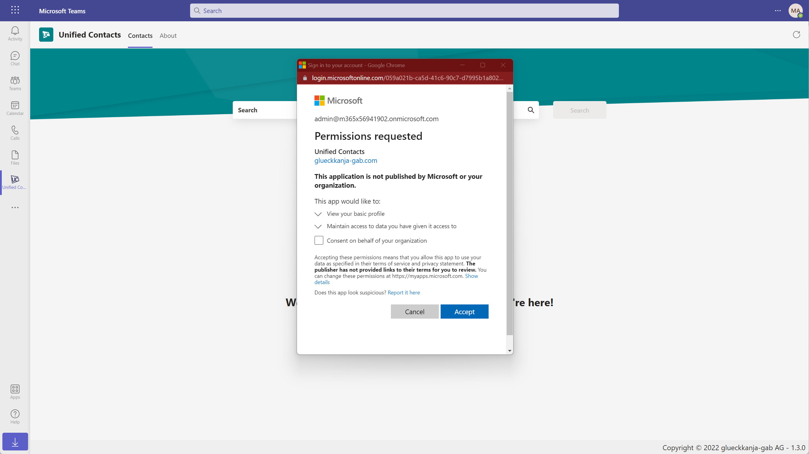
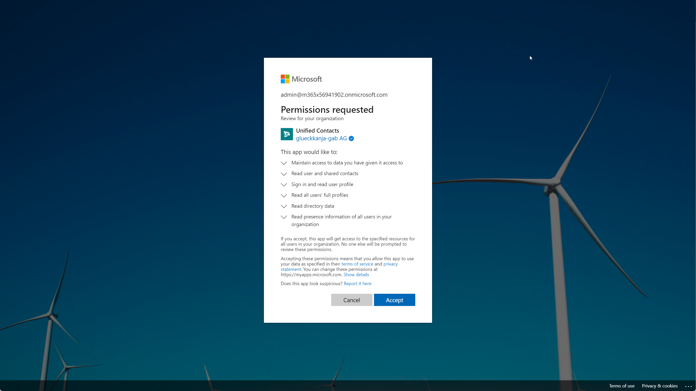

# Installation Guide


To install Unified Contacts in your tenant for the first time, some permissions have to be granted that require the **Global Admin** or **Cloud Application Admin** role.


Please follow these steps to install Unified Contacts in your tenant:

1. Navigate to the Unified Contacts offering in the [Microsoft Office App Store](https://appsource.microsoft.com/en-us/product/office/WA200003877) or locate the app under "Apps" in your Teams client.
2. If you are going through App Source, click on "Get it now" and sign in with your M365 credentials. A preview of Unified Contacts should appear in your Teams client.
3. Click "Add" and the app will be added to your tenant.
4.  To enable Unified Contacts to search for contacts in your Azure AD or your Exchange Online contact store, some permissions must be granted by the user and some by an administrator. Unified Contacts will only ask your for **read permissions**. You will therefore be prompted with the following prompt:\

    <figure><figcaption></figcaption></figure>
5.  Click "Continue" and you will be presented with the user consent. Unified Contacts requires the following permissions:

    * View your basic profile
    * Maintain access to data you have given it access to

    \
    **Optional**: To suppress the user consent dialogue for your users, consent on behalf of your organization.\

    <figure><figcaption></figcaption></figure>
6.  After accepting the user consent, Unified Contacts will inform you that some additional steps are required.\

    <figure><figcaption></figcaption></figure>
7.  Click "Grant" to invoke the admin consent. Unified Contacts requires the following admin-granted delegated permissions:

    * Maintain access to data you have given access to
    * **Read** user and shared contacts
    * Sign in and **read** user profile
    * **Read** all users' full profiles
    * **Read** directory data
    * **Read** presence information of all users in your organization

    <figure><figcaption></figcaption></figure>
8.  Unified Contacts is ready to be used.\

    <figure><figcaption>
 
</figcaption></figure>


After the admin consent is granted, it may initially take up to 60 seconds until the permissions are propagated and the search can be used.


