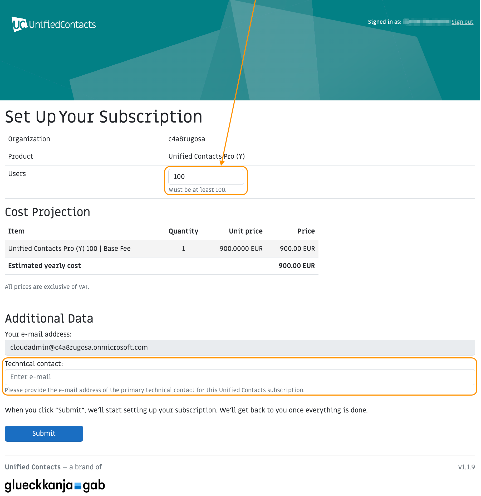

# Azure Marketplace

## Pricing Model

* Unified Contacts Pro is offered as a **monthly or** **annual subscription plan** with different [User Segments](azure-marketplace.md#user-segments). The correct **user segment** is automatically selected by our platform based on the amount of desired users.
* All subscription plans consist of a **base fee** which includes a certain amount of users per subscription cycle - depending on the **user segment**. For example, the **base fee** for the user segment _Unified Contacts Pro (M) 100_ includes 100 users per month.
* If more than the included amount of users is required, **additional users** can be added to the  plan. For each additional user, we charge an additional per-user fee.

## Invoicing

* During the first subscription interval, your subscription fees are not immediately due after completing the subscription enrolment. Instead we will start billing once your cancellation grace period has expired.&#x20;
* Upon every renewal date, you will be billed immediately.
* The related items should appear on your Microsoft Azure invoice (Pay-As-You-Go) the month after we have reported your fees to Microsoft.
* In the PDF invoice you will receive from Microsoft, all Unified Contacts fees are lumped into an item called "SaaS". The related Publisher is "glueckkanja-gab".

<figure><figcaption></figcaption></figure>


For a more detailed cost breakdown of your base and additional user fees, please refer to the invoice in your Azure portal.


## Plan Overview

Subscriptions for Unified Contacts are available based on a monthly or annual renewal interval.


The annual plan is discounted by 10% in comparison to the monthly plan (calculated over the period of 12 months).


| **Plan**                 | **Renewal Interval** |
| ------------------------ | -------------------- |
| Unified Contacts Pro (M) | Monthly              |
| Unified Contacts Pro (Y) | Annually             |

### User Segments

The following user segments are available for both, monthly and annual plans.&#x20;

<table data-header-hidden><thead><tr><th width="304.4424094315601">Plan</th><th width="244.07580174927114">Included Users</th><th></th></tr></thead><tbody><tr><td><strong>User Segment</strong></td><td><strong>Included Users in Base Fee</strong></td><td><strong>Maximum Total Users</strong></td></tr><tr><td>Unified Contacts Pro (M/Y) 100</td><td>100</td><td>999</td></tr><tr><td>Unified Contacts Pro (M/Y) 1000</td><td>1,000</td><td>4,999</td></tr><tr><td>Unified Contacts Pro (M/Y) 5000</td><td>5,000</td><td>9,999</td></tr><tr><td>Unified Contacts Pro (M/Y) 10000</td><td>10,000</td><td>unlimited</td></tr></tbody></table>

For prices in Euro (EUR), please check out our [website](https://www.unified-contacts.com/pricing). For prices in _your_ currency, please directly refer to the **Marketplace** in the [Azure Portal](https://portal.azure.com/).

## User Up- and Downgrades

### Upgrades

* If you would like to upgrade your user count, you can do that any time during the current subscription cycle by navigating to your **Unified Contacts subscription** in the [Azure SaaS portal](https://portal.azure.com/#blade/HubsExtension/BrowseResourceBlade/resourceType/Microsoft.SaaS%2Fresources) and by clicking "Open SaaS Account on publisher's site" (see screenshot below). This will re-direct you to our platform where the amount of users can be upgraded.

* After confirming your choice and once we have updated the license in our backend, you will receive a confirmation email from us.
* For the current cycle, we will bill the additional users for remaining days only.
* Our platform will inform you about the new fees you to expect for a **complete** subscription cycle.

### Downgrades

* Downgrading the amount of users is currently not possible without cancelling the subscription.
* If you want to perform a downgrade, please cancel your current subscription from the [Azure SaaS portal](https://portal.azure.com/#blade/HubsExtension/BrowseResourceBlade/resourceType/Microsoft.SaaS%2Fresources) towards the end of the current cycle by clicking "Cancel subscription" (see screenshot below) and re-subscribe with the desired user amount once the cancellation becomes effective.

## **Trials**

In case you would like to test Unified Contacts, please [get in contact with us](https://www.unified-contacts.com/start-now/#try) or send us an email to [sales@unified-contacts.com](mailto:sales@unified-contacts.com).

## How to purchase Unified Contacts Pro?

To get started with your Unified Contacts Pro subscription,

* Locate Unified Contacts Pro on the **Marketplace** in your [**Azure Portal**](https://azuremarketplace.microsoft.com/en-us/marketplace/apps/glueckkanja-gabag.unified-contacts-transactable-prod)&#x20;
* Select the Unified Contacts Pro **Plan** based on your preferred renewal interval and click "Subscribe"

<figure><figcaption></figcaption></figure>

* Create or select the **Resource group** you would like to deploy the subscription to
* Assign a **Name** to later identify your Unified Contacts subscription
* We recommend to keep **Recurring billing** on so that you do not have to worry about a manual renewal of your subscription.
* Click "Review + subscribe" and in the next blade "Subscribe" to deploy the subscription to your Azure SaaS portal.

<figure><figcaption></figcaption></figure>


The random order of **Base Fees** und **Additional Users** under the **Price** information is attributed to limitations of the Azure Marketplace. Later during the the enrolment process, we will provide you with transparent information on the expected licensing costs.


* Once the deployment is complete, please navigate to our platform by clicking "Configure account now"

<figure><figcaption></figcaption></figure>

* After authenticating on our platform using your Microsoft credentials, you will be prompted for additional information, such as the desired **total user amount** and a **technical admin contact**.

<figure><figcaption></figcaption></figure>

* Based on the amount of users provided on our platform, we will charge the relevant base fee for your user segment as well as additional users, in case you require more than the included amount in your base fee.
* The platform will show you the licensing fees you have to expect under **Cost Projection**.


For CSP deals we cannot display the Cost Projection as CSP margins might be in place. Discounts for private offerings cannot be displayed either.


* If you are happy with it, please complete the enrolment, which triggers us to generate a  license key for Unified Contacts. You will receive this key as part of our welcome email including all relevant information on the next steps regarding the deployment of Unified Contacts. This won't take any longer than one business day.


You will only be charged by Microsoft, once you have completed the enrolment on our landing page and received our welcome email.

