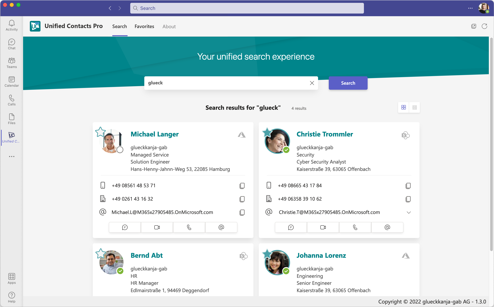

# Details

## Why Unified Contacts?

Unified Contacts is a Microsoft Teams app helping you to optimize contact search in the Teams ecosystem.

Microsoft Teams is a great tool for collaboration and communication. Unfortunately, it's quite difficult to find contacts for various reasons. For example:

* When you use the Microsoft Teams search bar to find contacts, the results are based on your corporate contacts from Azure AD.&#x20;
* When you use the Calls app in Microsoft Teams, you will only find contacts from Outlook.
* If you update a contact object in Microsoft Outlook, it can take hours before Microsoft Teams displays the updated information.
* There is no consolidated platform for contacts managed outside the Microsoft ecosystem.

Unified Contacts helps you, to simplify the discovery of contacts from various sources directly within your Microsoft Teams client - across all platforms.

## Features


Initiating PSTN calls from Unified Contacts requires Microsoft Teams Phone System.


### Overview

With Unified Contacts you can search for contacts in your **personal Outlook contacts** (Exchange Online is required) and simultaneously in the corporate address book **Azure AD**. Additionally, **Unified Contacts Pro** automatically searches your [**SharePoint Online**](advanced-configuration/sharepoint-online-lists.md) environment for compatible list types (contact-type), allowing you to build tools (e.g. through an Azure Logic App or Microsoft Power App) to sync contacts from external databases and CRM systems into a standardized format, that Unified Contacts Pro can read. Last but not least, **Unified Contacts Pro** provides a powerful [**Database**](advanced-configuration/uc-database/) which you can fill with **contacts from anywhere**, either leveraging our [**REST API**](advanced-configuration/uc-database/crud-operations-with-rest-api.md) or data integration services such as [**Azure Data Factory (ADF)**](advanced-configuration/uc-database/sync-data-with-azure-data-factory.md). The search results will be displayed in a comprehensive, interactive and coherent format across all your contact sources.

<figure><figcaption>
Unified Contacts Pro Search Overview
</figcaption></figure>

**Views**

Unified Contacts currently provides two views to display the search results: compact tiles and detailed tiles. The compact format gives you the most relevant contact information and access to all relevant controls while preserving space for more search results at a glance. The detailed tile gives you immediate access to all significant properties of the contact object and adds copy-to-clipboard controls.

 (1).png>) (2).png>)

Both views allow you to immediately

* Initiate a **Microsoft Teams call**
* Start a **Microsoft Teams chat**
* Compose an email in your default mail client
* Place a PSTN call (requires Microsoft Teams Phone System)&#x20;
* View the **presence status** in realtime (Azure AD contacts only)


Out-of-office notifications can currently not be displayed.


If case contacts contain multiple phone numbers or email addresses, Unified Contacts allows an easy selection of your desired phone number for dialing or email address for composing.


**Microsoft Teams calls and -chats** can also be seamlessly initiated for **external contacts**, if those contacts are enabled for Microsoft Teams and if the external tenant has **External access** enabled.


### Search Queries

Unified Contacts implements a search logic based on the "starts-with" strategy. Some properties of SharePoint Online contacts also support a "contains" approach (e.g. organization). Generally, Unified Contacts always searches the following properties across all contact sources:

* First name&#x20;
* Last name
* Job title
* Department
* Organization name

## Architecture

### Unified Contacts Free

The **Unified Contacts Free** backend is centrally hosted in our Azure tenant(s) for all customers (SaaS). To access the contact sources (Azure Active Directory and Exchange Online) in your tenant, Unified Contacts Free requires **Microsoft Graph** permissions that have to be granted during the [setup of the service](deployment/getting-started/installation-guide.md). Please note, that all permissions are based on a **delegation model**, i.e. Unified Contacts Free is only able to access those contacts that the signed in end-user has access to. The Unified Contacts Free Teams App (frontend) directly communicates with our backend to retrieve search results.

<figure><figcaption>
Unified Contacts Free Architectural Overview
</figcaption></figure>

### Unified Contacts Pro

Unlike **Unified Contacts Free**, the backend of **Unified Contacts Pro** is deployed into **your** **own Azure tenant**, giving you full control over the data the service processes. In fact, you can configure that **no data** (except limited and anonymous telemetry data required for license enforcement purposes) leaves your tenant at all.

The Unified Contacts Pro backend is running as an **Azure App Service**, powered by an **App Service Plan**. Besides the **App Service**, some additional resources are deployed, allowing us to host the binaries and to store data persistently (Azure DB). The individual resources are linked to each other via APIs, where the **Graph API** is used to access all your contact sources (Azure Active Directory, Exchange Online, SharePoint Online, UC Database). Permissions, roles and service principals are auto-generated and - assigned during deployment in your Azure AD.

<figure><figcaption>
Unified Contacts Pro Architectural Overview
</figcaption></figure>

